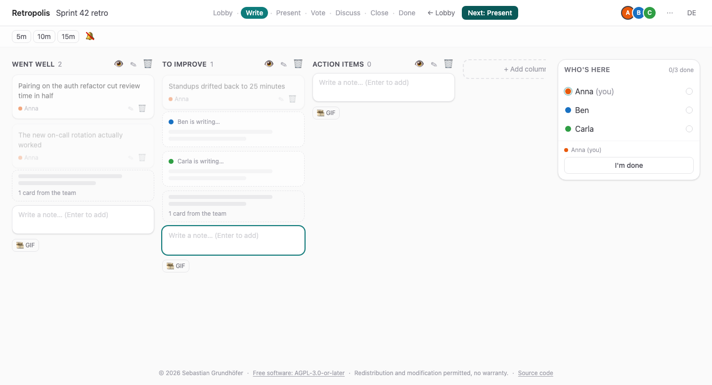
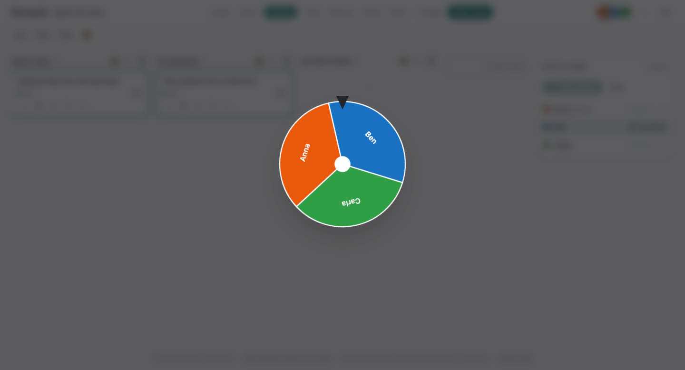
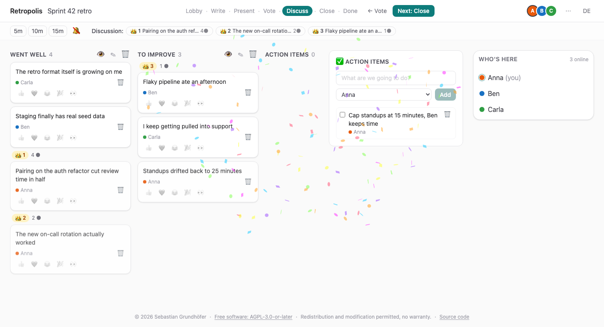
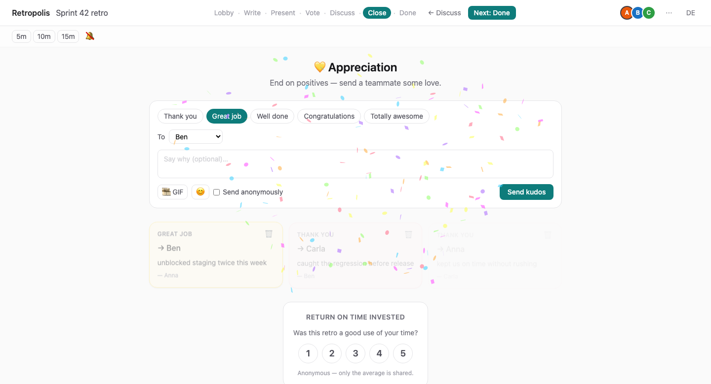

<div align="center">

# Retropolis

**Guided, playful, genuinely free retrospectives.**

No accounts. No tracking. German and English. Hosted in the EU.

[**Start a retro →**](https://retropolis.sebastiangrundhoefer.workers.dev) · [How it works](#how-a-retro-runs) · [Self-hosting](#self-hosting)

[](https://github.com/grundhofer/retropolis/actions/workflows/ci.yml)
[](LICENSE)

</div>



## Why another retro tool

Retro tools have split into two camps, and neither is much fun. The **guided** ones march you through a rigid wizard that feels like filing a report. The **playful** ones hand you an infinite canvas and a box of stickers — great, until a team that has run three retros in its life gets lost in it.

Meanwhile the market has quietly retreated from free. Retrium, TeamRetro and Spreo are trial-only. EasyRetro is down to one board a month. And almost nobody offers a German UI or keeps your data in the EU.

Retropolis is guided **and** playful **and** free. One facilitator steps the whole room through a clear phase flow. Everyone writes in private, presents in an order picked by a wheel of fortune, votes blind, and ends on appreciation.

## How a retro runs

### 1. Share a link

No accounts, no invites, no seat licences. Create a board, drop the URL into your team chat, everyone types a display name and they're in. The facilitator keeps a separate admin link.

### 2. Everyone writes in private


Nobody reads anybody else's notes until the facilitator reveals them — and that is **enforced on the server**, not merely hidden in the browser. You still see _that_ your colleagues are writing and how many cards exist, just never what they say.

No anchoring on whoever typed fastest. No quietly agreeing with the manager.

### 3. The wheel decides who speaks



The wheel picks the next presenter — or a slot machine, if you prefer. The draw happens on the server and replays deterministically on every screen, so everybody sees the same result at the same moment. The picked person's cards are spotlighted for the whole room.

It also quietly solves the problem where the same two people talk every sprint.

### 4. Vote blind, discuss what won



Dot voting with server-enforced budgets and no running tallies, so nobody piles onto the leader. When voting closes the top cards get crowned, the discussion queue walks them in order, and action items are captured while you talk.

### 5. End on appreciation



Kudos to teammates, anonymously if you'd rather. Then an anonymous ROTI poll — your own score stays private, and the average is withheld until three people have answered so it can't be differenced back to one person.

## What's in the box

- **6 templates** — Went well / To improve, Start-Stop-Continue, Mad-Sad-Glad, 4Ls, Sailboat, Starfish — plus custom columns
- **Two board layouts** — classic columns or a freeform canvas with draggable zones
- **A real phase flow** — write → present → vote → discuss → close, rewindable, and every step can be switched off for a shorter retro
- **Facilitation kit** — an optional opening check-in with 24 localized icebreakers, the Prime Directive, live-editable working agreements, and a shared timer with a chime
- **Grouping** — drag cards into stacks; votes and reactions come along
- **Staged columns** — prepare a column and reveal it to the room when you're ready
- **Emoji reactions and GIFs**, and confetti where it's earned
- **Exports** — Markdown, CSV, JSON. Author names are excluded by default.
- **Board duplication** — clone the structure for next sprint, nothing else
- **German and English** throughout, switchable mid-retro

## Privacy by default

The write phase is private because retros only work when people say the awkward thing. That principle runs through the rest too:

- **No accounts, ever.** No email, no password, no profile to delete later.
- **No tracking**, no analytics, no third-party requests you didn't ask for.
- **EU data residency** — every board lives in an EU-jurisdiction Durable Object, pinned at creation.
- **Boards auto-delete after 90 days**, or immediately when you say so.
- **Anonymity where it matters** — kudos, the ROTI poll, and the voting meter.

If you need to bring this past a German works council, [`docs/05-privacy-gdpr.md`](docs/05-privacy-gdpr.md) has the §87 BetrVG playbook, the data inventory and the sub-processor list already written up.

## Self-hosting

Retropolis runs on the Cloudflare free tier — one Worker plus a SQLite-backed Durable Object per board. There is no database to operate.

```sh
git clone https://github.com/grundhofer/retropolis.git
cd retropolis
pnpm install
pnpm --filter @retropolis/web run deploy   # needs `wrangler login`
```

Optional: set `KLIPY_API_KEY` as a Worker secret to switch on GIF search. Without it, GIF search simply reports itself as unavailable.

## Development

```sh
pnpm install
pnpm dev          # SPA + Worker + BoardRoom DO in real workerd, one command
```

### Tests (four layers)

```sh
pnpm --filter @retropolis/shared test   # 1. pure domain logic (node)
pnpm --filter @retropolis/worker test   # 2. Worker + DO in workerd, incl. WebSocket flows
pnpm --filter @retropolis/web test      # 3. components in real Chromium
pnpm test:e2e                           # 4. Playwright multi-context e2e
pnpm check && pnpm lint                 # types + lint
```

### Layout

```
apps/web        React SPA (Vite; the cloudflare plugin runs the worker in dev)
apps/worker     Hono API + BoardRoom Durable Object (wrangler config lives here)
packages/shared zod protocol + pure domain core (reducer, join, colors) — bulk of tests
e2e             Playwright specs
```

Domain logic lives in `packages/shared` as pure functions and is tested there; the Durable Object sequences and persists, it does not grow rules of its own.

### Deployment

`pnpm --filter @retropolis/web run deploy` builds and deploys via wrangler (needs `wrangler login`).
CI deploys are gated: set the repo variable `CLOUDFLARE_DEPLOY=true` plus the
`CLOUDFLARE_API_TOKEN` / `CLOUDFLARE_ACCOUNT_ID` secrets. PR previews go to the
`preview` environment (separate worker + DO namespace, alias `pr-<number>`).

Note: board DOs are pinned to the EU jurisdiction in production; local workerd
does not implement jurisdictions (see `apps/worker/src/board-stub.ts`).

## The plan

The full thinking lives in [PLAN.md](PLAN.md) and [docs/](docs/) — product spec, architecture, an 11-tool competitive analysis, roadmap, the GDPR playbook, and the licensing/trademark file. Current state: **v1.2, M0–M6 shipped**.

## Contributing

Pull requests need a signed [Contributor License Agreement](CLA.md) — a bot checks this and tells you what to do. Read [CONTRIBUTING.md](CONTRIBUTING.md) first; it explains the reasoning and the house rules. Open an issue before building anything larger than a bug fix.

## License

Copyright © 2026 Sebastian Grundhöfer.

Retropolis is free software under the **GNU Affero General Public License v3.0 or later** — see
[LICENSE](LICENSE). Every source file carries an [SPDX](https://reuse.software) header.

If you run a modified Retropolis and let others reach it over a network, AGPL §13 requires you to
offer those users the source of your version. The licence rationale, the monetisation model it keeps
open, and the dependency-licence policy are documented in [docs/06-legal.md](docs/06-legal.md).
